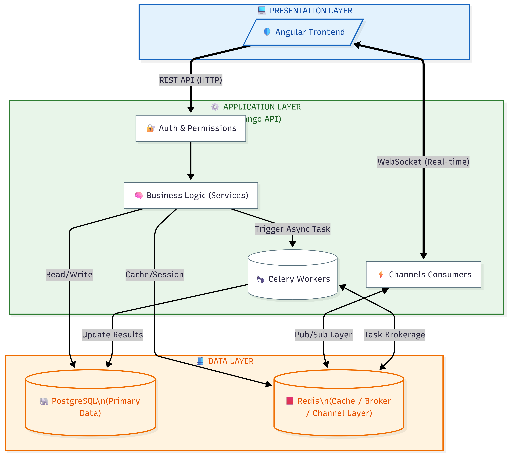

# TeamOps 🚀

TeamOps is a backend-focused team collaboration and task management platform
designed with production-grade architecture and security principles.

The project emphasizes:
- clean domain modeling
- strict access control
- auditability
- real-time, authorized communication between users

The frontend is intentionally minimal; the primary focus is building
robust backend infrastructure similar to real-world internal tools.

---

##  Architecture
The following diagram illustrates the  architecture of TeamOps

## Architecture Highlights

- **Django + PostgresSQL** backend
- **JWT-based authentication** (REST & WebSockets share the same auth system)
- **Role-aware, object-level access control**
- **Queryset-level data isolation**
- **Soft delete with controlled visibility**
- **Audit logging with field-level diffs**
- **ASGI-based real-time communication using Django Channels and Redis**
- **Strict Git workflow with feature branches and PR-based merges**

## Real-Time Features (WebSockets)

TeamOps supports real-time updates using **Django Channels**, **ASGI**, and **Redis**.

### Authentication & Authorization
- WebSocket connections require **JWT authentication**
- Anonymous connections are rejected at handshake
- `scope["user"]` behaves the same as `request.user` in REST APIs

### Project-Based Isolation
- Each project has its own WebSocket group
- Only project members can connect and receive events
- Cross-project data leakage is strictly prevented

### Real-Time Task Events
Task lifecycle events are broadcast in real time to authorized project members:
- Task creation
- Task updates
- Soft deletion
- Restore events

All real-time events are **server-authoritative** and emitted only from backend
domain events — clients cannot publish arbitrary messages.

## Project Status

This project is actively under development.

Recent milestones:
- Production-grade audit logging
- JWT-authenticated WebSockets
- Project-scoped real-time communication
- Real-time task event broadcasting

Upcoming work includes:
- Event reliability & delivery guarantees
- Fine-grained real-time permissions
- Activity feeds and live dashboards

---

## Production Setup

### 1. Environment
Copy `.env.example` to `.env` and set real values:
- `DEBUG=False`
- `SECRET_KEY=<strong-random-value>`
- `ALLOWED_HOSTS=<your-domain>`
- `CSRF_TRUSTED_ORIGINS=https://<your-domain>`
- `CORS_ALLOWED_ORIGINS=https://<frontend-domain>`
- `DATABASE_URL=postgres://...`
- `REDIS_URL=redis://...`

### 2. Local production-like run with Docker

```bash
docker compose -f docker-compose.prod.yml up --build -d
```

API will be available at `http://localhost:8000`.

### 3. Health check

```bash
curl http://localhost:8000/healthz/
```

Expected response:

```json
{"status":"ok"}
```

### 4. Recommended edge/proxy requirements
- Serve traffic over HTTPS.
- Forward `X-Forwarded-Proto` header.
- Restrict ingress to required ports only.
- Keep PostgreSQL/Redis private to the network.

### 5. Kubernetes manifests

Backend Kubernetes manifests are in `deploy/k8s/`:
- `namespace.yaml`
- `secret.template.yaml` (fill values and apply as `backend-secrets`)
- `configmap.yaml`
- `backend-deployment.yaml` (Django via Gunicorn)
- `backend-service.yaml` (service name: `backend-service`)
- `celery-worker-deployment.yaml`
- `celery-beat-deployment.yaml`

Apply order:

```bash
kubectl apply -f deploy/k8s/namespace.yaml
kubectl apply -f deploy/k8s/secret.template.yaml
kubectl apply -f deploy/k8s/configmap.yaml
kubectl apply -f deploy/k8s/backend-deployment.yaml
kubectl apply -f deploy/k8s/backend-service.yaml
kubectl apply -f deploy/k8s/celery-worker-deployment.yaml
kubectl apply -f deploy/k8s/celery-beat-deployment.yaml
```

